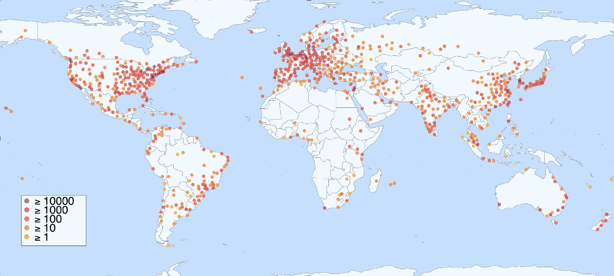
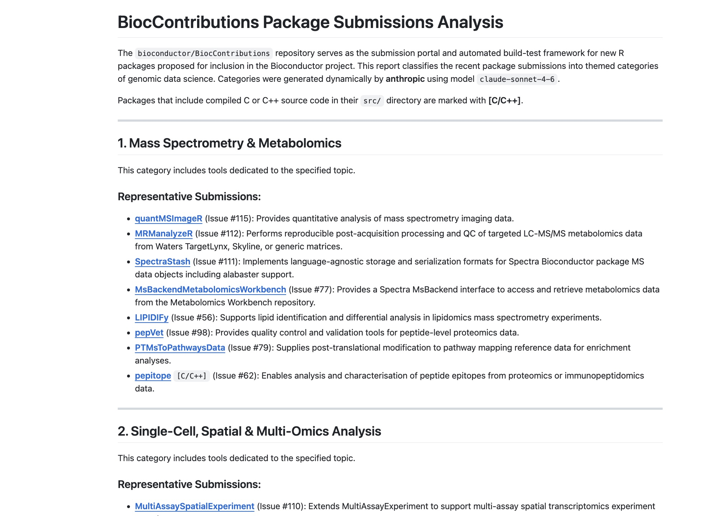
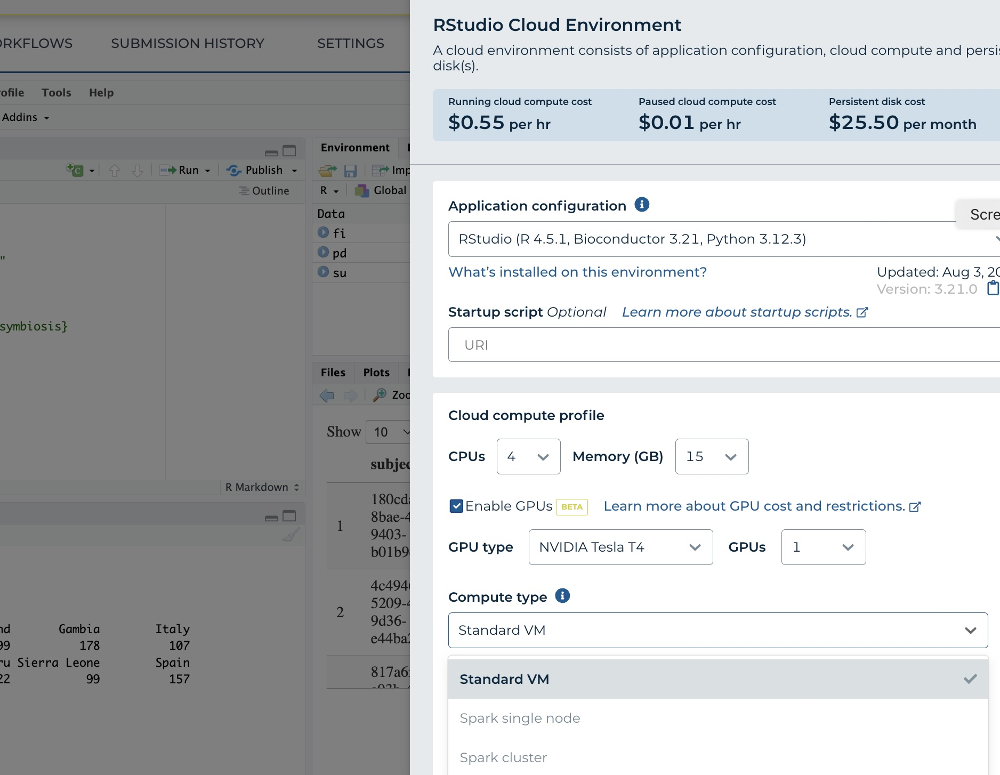
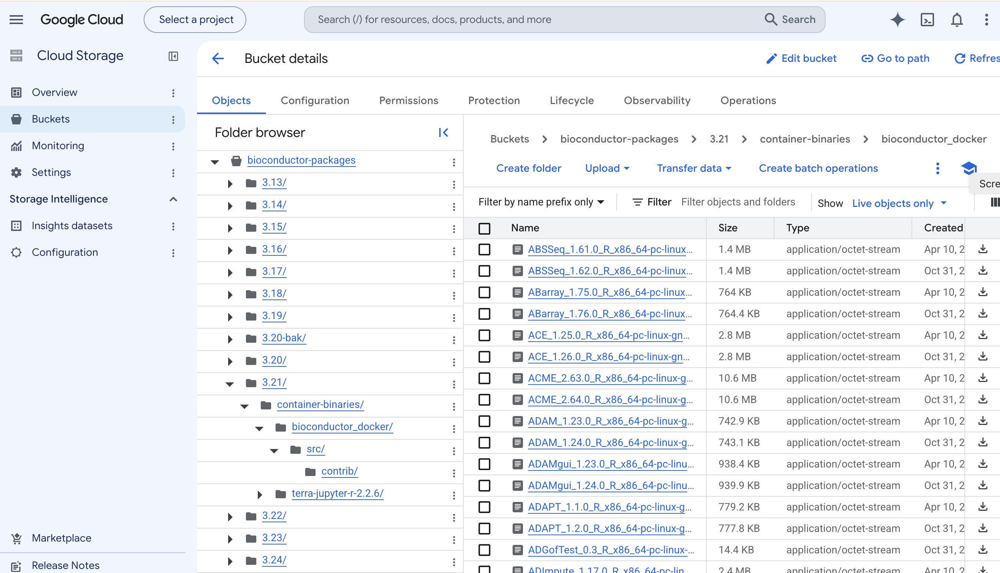

# Introduction

Vignette content is from commit `r system("git rev-parse --short HEAD", intern = TRUE)`.

The aim of this package is to provide content for a 10 minute talk at ACC 2026.

A shiny app will also be demonstrated.

# Review

## What is Bioconductor?

Largest genomics software ecosystem, 25 years old



### Sentiments from NIH renewal review: 

- Bioconductor is an essential infrastructure for the genomic data analysis enterprise
- It has consistently provided the most robust, well-maintained, and state-of-the-art
genomic data analysis software 
- By providing rigorously reviewed, interoperable software built on standardized frameworks, Bioconductor
addresses the critical need for reproducible genomic analysis
- The amount of coordination and integration Bioconductor has with other resources is
impressive ... embedded within AnVIL, connected with 19 other U24 projects, and
interoperable with external ecosystems such as Galaxy and Seurat ...

### 2200+ packages in ecosystem; 95 new ones in review



### New visibility, QA, and distribution processes coming soon

## New directions provoked by AnVIL

### Instant advanced compute



### Instant ecosystem components

Container-based AnVIL cloud environments are used to pre-compile all packages.
BiocManager identifies the requesting environment and ships appropriate binary.
Per-session compilation is not needed.



## The 'basic stack' of methods

```{r ch1,message=FALSE}
library(AnVIL)
library(dplyr)
library(DT)
library(ggplot2)
ls("package:AnVIL")
```

# Application to 1KG in PRIMED model

## (Metadata) tables that were imported for ACC26

```{r ch2}
avtables()
```

## Searchable view of `anvil_file`; queries

```{r ch3}
avtable("anvil_file") |> as.data.frame() |> datatable()
```

Recruitment source frequencies

```{r chk4}
 avtable("population_descriptor") |> select(`pfb:country_of_recruitment`) |>
     mutate(country=`pfb:country_of_recruitment`) |> group_by(country) |> summarise(n=n()) |> 
     ggplot(aes(x=country, y=n)) + geom_col() + theme(axis.text.x = element_text(angle = 45, hjust = 1))
```

Ancestry frequencies
 
```{r chk5}
 avtable("population_descriptor") |> select(`pfb:population_label`) |>
     mutate(pop=`pfb:population_label`) |> group_by(pop) |> summarise(n=n()) |> 
     ggplot(aes(x=pop, y=n)) + geom_col() + theme(axis.text.x = element_text(angle = 45, hjust = 1))
```

Locations

```{r domap, echo=FALSE, message=FALSE}
# ------------------------------------------------------------------
# 1000 Genomes + HGDP contribution frequencies -- interactive world map
# ------------------------------------------------------------------
# Reads popfreqs.csv (columns: "", Var1 = country, Var2 = "POPCODE | SUPERPOP",
# Freq = number of contributed samples) and plots one circle marker per
# population at its approximate real-world sampling location, sized and
# colored by contribution frequency / superpopulation.
#
# Packages needed: leaflet, dplyr, tidyr, htmlwidgets
# install.packages(c("leaflet", "dplyr", "tidyr", "htmlwidgets"))

library(leaflet)
library(dplyr)
library(tidyr)
library(htmlwidgets)

# ---- 1. Read and tidy the data -----------------------------------

csv_path <- "popfreqs.csv"   # change to the path of popfreqs.csv on your machine

raw <- read.csv(csv_path, row.names = 1, stringsAsFactors = FALSE)

pf <- raw %>%
  separate(Var2, into = c("PopCode", "SuperPop"), sep = "\\|") %>%
  mutate(
    PopCode  = trimws(PopCode),
    SuperPop = trimws(SuperPop),
    Country  = trimws(Var1)
  ) %>%
  select(Country, PopCode, SuperPop, Freq)

# ---- 2. Approximate sampling coordinates for each 1000G/HGDP population ----
# (real-world collection sites, not just country centroids, so that
#  populations sharing a country -- e.g. USA, UK, China, Nigeria -- don't
#  all stack on the same point)

coords <- tribble(
  ~PopCode, ~lat,    ~lng,
  "ACB",     13.19,  -59.54,   # Barbados
  "ASW",     35.47, -97.52,    # African ancestry, SW USA
  "BEB",     23.68,  90.35,    # Bangladesh
  "CDX",     22.01, 100.80,    # Dai, Xishuangbanna, China
  "CEU",     39.32,-111.09,    # Utah, USA (N & W European ancestry)
  "CHB",     39.90, 116.41,    # Beijing, China
  "CHS",     23.13, 113.26,    # Southern China
  "CLM",      6.25, -75.56,    # Medellin, Colombia
  "ESN",      6.50,   6.00,    # Esan, Nigeria
  "FIN",     61.92,  25.75,    # Finland
  "GBR",     51.50,  -0.13,    # Great Britain
  "GIH",     29.76, -95.37,    # Gujarati, Houston, USA
  "GWD",     13.45, -15.50,    # Gambia
  "IBS",     40.00,  -4.00,    # Spain
  "ITU",     51.60,   0.05,    # Indian Telugu, UK
  "JPT",     35.68, 139.69,    # Tokyo, Japan
  "KHV",     10.80, 106.60,    # Kinh, Ho Chi Minh City, Vietnam
  "LWK",      0.60,  34.77,    # Webuye, Kenya
  "MSL",      8.46, -13.23,    # Sierra Leone
  "MXL",     34.05,-118.24,    # Mexican ancestry, Los Angeles, USA
  "PEL",    -12.05, -77.04,    # Lima, Peru
  "PJL",     31.55,  74.35,    # Punjabi, Lahore, Pakistan
  "PUR",     18.22, -66.59,    # Puerto Rico, USA
  "STU",     51.40,  -0.30,    # Sri Lankan Tamil, UK
  "TSI",     43.77,  11.25,    # Tuscany, Italy
  "YRI",      7.38,   3.90     # Yoruba, Ibadan, Nigeria
)

pf <- pf %>% left_join(coords, by = "PopCode")

if (any(is.na(pf$lat))) {
  warning("Missing coordinates for: ",
          paste(pf$PopCode[is.na(pf$lat)], collapse = ", "))
}

# ---- 3. Color palette by superpopulation --------------------------

superpops <- sort(unique(pf$SuperPop))
pal <- colorFactor(palette = "Set1", domain = superpops)

# ---- 4. Scale marker radius by frequency ---------------------------

radius_scale <- function(freq, min_r = 6, max_r = 22) {
  rng <- range(pf$Freq)
  if (diff(rng) == 0) return(rep((min_r + max_r) / 2, length(freq)))
  min_r + (freq - rng[1]) / diff(rng) * (max_r - min_r)
}

pf <- pf %>% mutate(radius = radius_scale(Freq))

# ---- 5. Build the leaflet map --------------------------------------

map <- leaflet(pf) %>%
  addProviderTiles(providers$OpenStreetMap) %>%
  # Note: some tile providers (e.g. CartoDB, Stadia, Thunderforest) now
  # require a registered API key and will otherwise print "API key
  # required" across every tile. OpenStreetMap and Esri.WorldGrayCanvas
  # remain free/keyless as of 2026.
  addCircleMarkers(
    lng = ~lng, lat = ~lat,
    radius = ~radius,
    color = ~pal(SuperPop),
    fillColor = ~pal(SuperPop),
    fillOpacity = 0.75,
    stroke = TRUE,
    weight = 1.5,
    label = ~paste0(PopCode, " (", Country, "): ", Freq),
    popup = ~paste0(
      "<b>", PopCode, "</b> &mdash; ", Country, "<br>",
      "Superpopulation: ", SuperPop, "<br>",
      "Contributed samples: ", Freq
    )
  ) %>%
  addLegend(
    position = "bottomright",
    pal = pal,
    values = ~SuperPop,
    title = "Superpopulation",
    opacity = 0.9
  ) %>%
  setView(lng = 20, lat = 15, zoom = 2)

map

# ---- 6. (optional) save to a standalone HTML file -------------------
#saveWidget(map, "popfreqs_map2.html", selfcontained = TRUE)
```


# Aspects of symbiosis in the future

## Monarch harmonization concepts -- all OBO ontologies programmatically available via ontoProc2

## BiocJobs -- explicit formulations of workflow components in packages


## Language-agnostic data and annotation services

## Integration with LLMs -- see the AI workshop 


